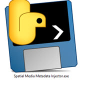
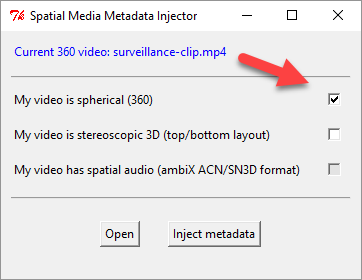

# Long Video Classic Plug-in for RICOH THETA

Overcomes 25 minute video limitation of the standard THETA V.
Uses standard bitrate encoding and H.264 compression. 

## Limitations

* No spatial audio. The code can be modified to save a 4ch spatial audio .wav file with first-order ambisonics B-format. 
The spatial audio file is not saved by default to avoid people having to delete the file.
* metadata is stripped out of the file. You may need to inject the metadata using a tool after your shoot. Instructions are below. 

## Installation and Setup

If you are are compiling from source, follow these steps for installation:

1. install plug-in with adb
2. set permissions with Vysor
3. use the THETA Desktop app to set the default plug-in "Long Video Classic"

## Usage

1. put camera into plug-in mode
2. take video
3. stop plug-in by pressing lower mode button
4. turn camera off by pressing the power button for 8 seconds
5. turn camera back on and plug into your computer with a USB cable
6. look for the file in /RICOH THETA V/Fixed Storage/DCIM/100RICOH

## Post Production

### Spatial Media Metadata Injector

You may need to inject the metadata into the video file
with [Spatial Media Metadata Injector](https://github.com/google/spatial-media/releases).

Install the binary file with the link above. Pre-built applications are available for Mac and Windows.

Open the file.

Save the file with metadata injected with a new filename. Use the new video file
with injected metadata in your applications and on YouTube/Facebook.

## Related Plug-in

The [4k-long-video](https://github.com/theta360developers/4k-long-video) 
plug-in uses HEVC compression and lower bitrate encoding. It can save longer
videos and the file size will be smaller. However, you may have problems
dealing with HEVC videos with some applications.

